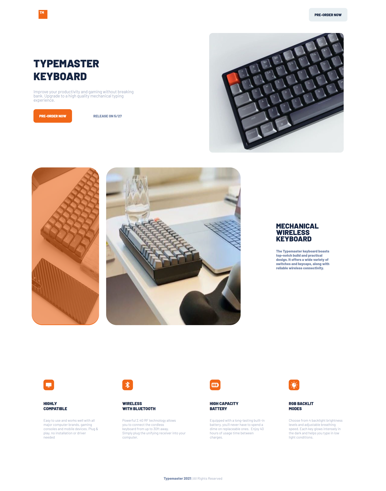
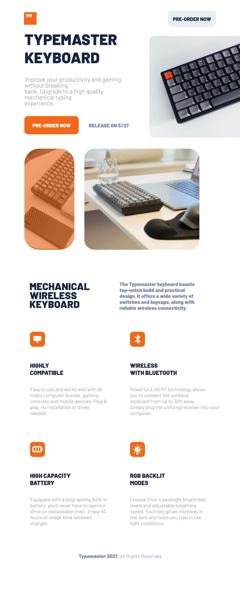
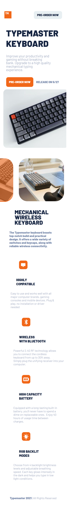

# typemaster_plp_3 | README Guide

# Project Discription

The typemaster landing page is a web application that helps users to improve your productivity and gaming without breaking
bank. Upgrade to a high quality mechanical typing experience. It enables users to:

1. View the optimal layout depending on their device's screen size.
2. See hover states for interactive elements.

## Live Project Link
https://typemaster-tau.vercel.app/

## Tech Stack

## Features

1. Device responsiveness.
2. Hover button effect.

## Preview

## Desktop 

## Tablet

## Phone

## Lessons Learned

Learned how to use media queries to make a page responsive.

## 
[@Godbless-Abbew] (https://github.com/Godbless-Abbew)